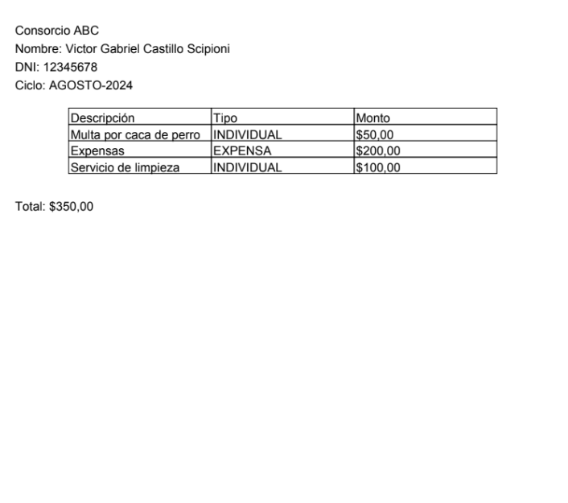

# Aplicación de Creación y Envío de Facturas en PDF

Esta aplicación en Java crea una factura en formato PDF y la envía por correo electrónico usando una cuenta de Gmail. A continuación, se describen los componentes de la aplicación, cómo funciona y cómo generar una contraseña de aplicación para Gmail.

## Ejemplo

## Componentes de la Aplicación

1. **Generación de PDF**:
    - La aplicación utiliza la biblioteca iText para crear un archivo PDF que contiene la factura. La factura incluye detalles como el nombre del consorcio, los datos del propietario, el ciclo de cobro y una tabla con los cargos.

2. **Envío de Email**:
    - La aplicación utiliza la biblioteca JavaMail para enviar el PDF por correo electrónico. Se requiere una cuenta de Gmail para el envío del correo.

## Funcionamiento de la Aplicación

1. **Entrada de Datos**:
    - La aplicación solicita al usuario su correo electrónico de Gmail y una contraseña específica para la aplicación.
    - Luego solicita la dirección de correo electrónico del destinatario.

2. **Creación del PDF**:
    - Se genera una factura en formato PDF usando los datos proporcionados. La factura incluye una lista de cargos y el total a pagar.

3. **Envío del PDF por Email**:
    - El PDF generado se adjunta a un correo electrónico y se envía al destinatario especificado.

## Pasos para Generar una Contraseña de Aplicación para Gmail

Para que la aplicación funcione correctamente con una cuenta de Gmail, necesitas generar una contraseña específica para la aplicación si tu cuenta está configurada con la verificación en dos pasos. Aquí están los pasos para hacerlo:

1. **Habilitar la Verificación en Dos Pasos**:
    - Ve a tu [cuenta de Google](https://myaccount.google.com/).
    - En la sección de **Seguridad**, activa la **Verificación en dos pasos** si aún no está habilitada.

2. **Generar una Contraseña de Aplicación**:
    - Una vez que la verificación en dos pasos esté habilitada, ve a la [sección de Contraseñas de Aplicación](https://myaccount.google.com/apppasswords).
    - Si no ves esta opción, asegúrate de haber activado la verificación en dos pasos.
    - En el menú **Seleccionar aplicación**, elige **Correo**.
    - En el menú **Seleccionar dispositivo**, elige **Otro** y proporciona un nombre para la aplicación (por ejemplo, "Mi Aplicación de Factura").
    - Haz clic en **Generar**. Aparecerá una contraseña específica para la aplicación.

3. **Usar la Contraseña de Aplicación**:
    - Copia la contraseña generada y úsala en lugar de tu contraseña habitual en el archivo [Main](src/main/java/Gabriel/Dev/com/Main.java)
      para el envío del correo electrónico.

## Ejemplo de Uso

1. Ejecuta la aplicación y proporciona tu correo electrónico de Gmail.
2. Introduce la dirección de correo electrónico del destinatario.
3. La aplicación generará un archivo PDF con la factura y lo enviará por correo electrónico.

## Dependencias

La aplicación utiliza las siguientes bibliotecas:
- iText (para la generación del PDF)
- JavaMail (para el envío del correo electrónico)
- Java Activation Framework (para manejar archivos adjuntos)

## Configuración

Asegúrate de tener las siguientes bibliotecas en tu classpath:
- `itextpdf-5.5.13.4.jar`
- `javax.mail-1.6.2.jar`
- `activation-1.1.jar`

## Contribuciones

Las contribuciones son bienvenidas. Si encuentras algún problema o tienes mejoras, por favor envía un pull request o abre un issue.

## Contacto

Para cualquier pregunta o problema, puedes contactar al desarrollador en gabriel.scipioni21@gmail.com.
